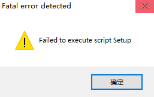
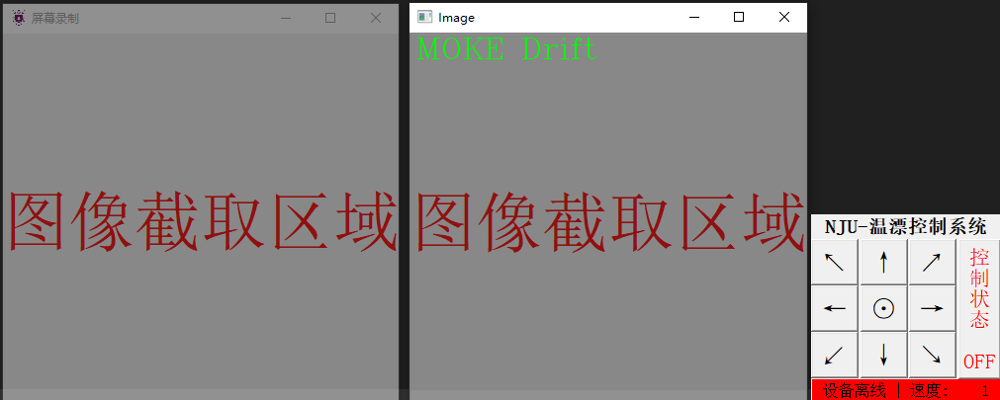

# MOKE显微镜 温漂控制系统 使用说明

>对应版本: `Version.21.01.20.04`
>
>发布日期: `2020年01月20日`
>
>运行环境: `Windows 10`, `MOKE显微镜相关硬件设备`, `建议多个显示屏`
>
>发布渠道: [`Github`](https://github.com/zzudongxiang/NJU_Yuan.Drift/releases)


## 0. 快速使用帮助

> 1. **点击Setup.exe运行程序**
> 2. **在桌面右下角菜单栏中, 使用 `↖`, `↑`, `↗`, `←`, `→`, `↙`, `↓`, `↘` 控制位移台移动**
> 3. **在桌面右下角菜单栏中, 使用`⊙`实现位移台移动速度档位切换**
> 4. **在桌面右下角菜单栏中, 使用`控制状态OFF`或`控制状态ON`开启或关闭温漂控制系统**
> 5. **点击`屏幕截取`窗口的`关闭`按键实现程序的退出**
> 6. **储存的数据文件在`./data/`路径下**


## 1. 程序文件目录

```text
文件目录
|- Setup.exe                [程序入口, 使用该exe启动软件]
|- lib/                     [程序执行需要的资源文件, 删除后将会报错]
    |- Config.json          [用户可以自定义的一些设置属性, 详见后文]
    |- MT_API_64.dll        [控制位移台所必须的dll调用库]
    |- NJU.ico              [程序界面所必须的图标文件]
|- data/                    [程序自动创建的文件夹, 储存每次实验的数据]
    |- xxxx.../             [以时间命名的文件夹, 储存实验数据]
        |- Ori/             [储存采集到的原始图像数据, 图像保存格式为*.bmp]
            |- file.bmp     [以序号进行索引的图片文件]
            |- ......
        |- Sub/             [储存处理后的图像与背景相减的结果]
            |- file.bmp     [文件命名格式同Ori文件夹]
            |- ......
        |- Warp/            [储存经过识别偏移后的图像数据]
            |- file.bmp     [文件命名格式同Ori文件夹]
            |- ......
        |- Background.bmp	[单次实验所记录的背景图案]
        |- Logs.dat         [记录的每次得到的偏移量集合以及识别的结果]
```

**缺少 lib 文件夹下的资源文件可能会出现以下错误提示**



## 2. 程序界面操作说明

**第一次打开可能会稍有卡顿, 请耐心等待程序启动**



启动后会出现以上三个窗口, 其中:

> `屏幕录制` 窗口呈现为半透明, 主要作用为采集窗口所在区域的屏幕图像, 以供程序分析
>
> `Image` 窗口呈现为不透明窗口, 左上角显示当前预览的图像内容, 在控制状态下可预览多种图像
>
> `NJU-温漂控制系统` 窗口不可移动, 常驻桌面右下角, 主要包含相关的功能菜单

### 2.1 界面功能说明

- **屏幕录制 界面**

  1. 使用鼠标将窗口拖动到待捕捉的画面上
  2. 在窗口边缘使用鼠标拖动窗口大小, 以调整到合适的识别范围
  3. 确定好大小与位置后点击最小化隐藏窗口即可
  
- **Image 预览界面**

  1. 在温漂控制状态下点击画面任意位置可以实现预览图像的切换

     `匹配结果显示` - `背景图像显示` - `实时图像显示` - `漂移纠正结果显示` - `图像相减结果显示`

  2. 该窗口在不需要的时候可以隐藏, 点击关闭后会自动刷新出现

- **功能菜单 界面**
  
  1. 常驻桌面右下角, 且置顶显示, 用户无法移动窗口位置或修改窗口大小
  2. 中心 `↖`, `↑`, `↗`, `←`, `→`, `↙`, `↓`, `↘` 按键可以实现位移台的水平方向移动
  3. 中心 `⊙` 按键可以实现移动速度的档位切换, 档位速度由用户自定义
  4. 右侧`控制状态 OFF` 按键, 点击切换是否开启温漂控制系统, 红色为 `OFF` 状态, 绿色为 `ON` 状态
  5. 下端显示当前位移台设备的状态, 红色表示设备未连接, 绿色表示设备已连接

### 2.2 程序开启与关闭

- 程序可通过运行 `Setup.exe` 实现运行

- 需要关闭程序时请关闭 `屏幕录制` 界面, 其他界面会同步注销

- 建议停止 `温漂控制` 状态后再关闭程序

### 2.3 程序工作流程

- **手动控制位移台功能**

  1. 确保程序未开启温漂控制功能, 否则将无法使用手动控制
  2. 手动控制可以通过点击`⊙` 按键实现速度档位的切换

- **温漂控制功能**

  1. 开启后会抓拍一张图像作为背景图像
  
  2. 创建以当前时间命名的工作文件夹, 稍后抓取的数据将储存在该文件目录下
  
  3. 抓图图片, 处理图像, 储存处理结果
  
  4. 是否匹配失败(当前图像与背景图像差异较大, 没有足够多可信任的匹配点)
  
  5. 是否已超时, 设定连续匹配失败10秒算作超时
  
  6. 如果匹配失败且超时, 则停止抓拍处理, 并弹窗警告
  
     

## 3. 配置文件的修改

**配置文件以json格式保存, 具体保存格式参加json文件格式要求**

```json
{
    "Correct": {
        "MatchRange": 50,
        "MatchCount": 20
    },
    "Stepper": {
        "CorrectStep": [1.7, -1.7],
        "SpeedStep": [2000, 1000, 500, 100, 1],
        "SteperInvert": [0, 1]
    },
    "Windows": {
        "Size": [500, 500],
        "ThumbRate": 0.3,
        "LineSize": 2,
        "LineColor": [0, 0, 255],
        "StrSize": 1,
        "StrColor": [0, 255,0]
    }
}
```

- **Correct 节点**

  `MatchRange` 

  接受: 浮点类型数据, 大于0

  匹配的范围, 即: 背景中特征点A与图像中的特征点B的像素距离高于该值时认为匹配无效

  

  `MatchCount`

  接受: 浮点类型数据, 大于0

  匹配结果置信度, 即: 当匹配结果中有效的匹配特征点个数小于该值认为匹配结果无效

  

- **Stepper 节点**

  `CorrectStep`

  接受: 浮点类型数据, 小于0时运动反转

  在进行温漂控制时, 每个像素代表的位移台脉冲个数, 该值过大会造成震荡, 建议不要过大

  

  `SpeedStep`

  接受: 整数类型, 大于0

  在手动控制时档位按照该列表进行切换, 且自动控制时会使用当前的速度作为控制速度

  

  `SteperInvert`

  接受: 整数类型, 任意值

  对应的轴运动方向是否反转, 如果是0则不反转 , 否则运动方向反转

  

- **Windows 节点**

  `Size`

  接受: 不建议人为修改, 由程序自动管理

  储存截取屏幕的范围大小, 便于下次打开时依旧保持同样大小

  

  `ThumbRate`

  接受: 浮点小数, 大于0且小于1 (注意不包含0和1)

  指在 `匹配结果显示图` 中背景所占的比例大小, 一般小于0.5

  

  `LineSize`, `LineColor`

  接受: 整数, 大于0, `LineColor`只接受0~255之间的整数

  绘制`匹配结果显示图`时, 该值可以控制匹配线的大小与颜色, 颜色的数组格式为 GBR

  

  `StrSize`, `StrColor`

  接受: 整数, 大于0, `StrColor`只接受0~255之间的整数

  绘制预览图象的标题时时, 该值可以控制显示标题的大小与颜色, 颜色的格式为 GBR

  
  
- **RawData 节点**
  
  `Ori`
  
  接受: 整数, 任意数值(建议0或1)
  
  指在输出数据中是否保存原始的CCD图像, 0表示不保存, 其他表示保存
  
  `Warp`
  
  接受: 整数, 任意数值(建议0或1)
  
  指在输出数据中是否保存偏移纠正的图像, 0表示不保存, 其他表示保存
  
  `Sub`
  
  接受: 整数, 任意数值(建议0或1)
  
  指在输出数据中是否保存相减的结果, 0表示不保存, 其他表示保存
  
  

## 4. 其他说明事项

- **项目开源在 [Github](https://github.com/zzudongxiang/NJU_Yuan.Drift) 上, 如果疑问可联系 [zzudongxiang](mailto:zzudongxiang@163.com)**

- **如果具有多个显示屏, 则只能捕获和处理主显示屏上的图像**